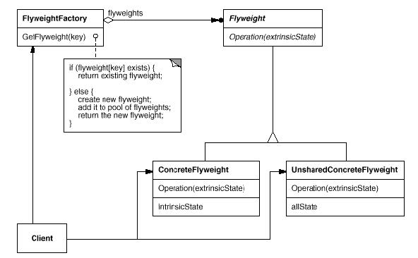
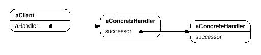

# PAFR SUMMARY
<!-- TOC depthFrom:1 depthTo:6 withLinks:1 updateOnSave:1 orderedList:0 -->

- [PAFR SUMMARY](#pafr-summary)
	- [Creational Patterns](#creational-patterns)
		- [Abstract Factory Pattern](#abstract-factory-pattern)
			- [Applicability](#applicability)
			- [Structure](#structure)
			- [Consequences](#consequences)
			- [Implementation](#implementation)
				- [Extensible Implementation](#extensible-implementation)
		- [Builder Pattern](#builder-pattern)
			- [Applicability](#applicability)
			- [Structure](#structure)
			- [Consequences](#consequences)
			- [Implementation](#implementation)
		- [Factory Method Pattern](#factory-method-pattern)
			- [Applicability](#applicability)
			- [Structure](#structure)
			- [Consequences](#consequences)
			- [Implementation](#implementation)
		- [Prototype Pattern](#prototype-pattern)
			- [Applicability](#applicability)
			- [Structure](#structure)
			- [Consequences](#consequences)
			- [Implementation](#implementation)
		- [Singleton Pattern](#singleton-pattern)
			- [Applicability](#applicability)
			- [Structure](#structure)
			- [Consequences](#consequences)
			- [Implementation](#implementation)
	- [Structural Patterns](#structural-patterns)
		- [Adapter Pattern](#adapter-pattern)
			- [Applicability](#applicability)
			- [Structure](#structure)
				- [Adapter through inheritance](#adapter-through-inheritance)
				- [Adapter through composition](#adapter-through-composition)
			- [Consequences](#consequences)
			- [Implementation](#implementation)
		- [Bridge Pattern](#bridge-pattern)
			- [Applicability](#applicability)
			- [Structure](#structure)
			- [Consequences](#consequences)
			- [Implementation](#implementation)
		- [Composite Pattern](#composite-pattern)
			- [Applicability](#applicability)
			- [Structure](#structure)
			- [Consequences](#consequences)
			- [Implementation](#implementation)
		- [Decorator Pattern](#decorator-pattern)
			- [Applicability](#applicability)
			- [Structure](#structure)
			- [Consequences](#consequences)
			- [Implementation](#implementation)
		- [Facade Pattern](#facade-pattern)
			- [Applicability](#applicability)
			- [Structure](#structure)
			- [Consequences](#consequences)
			- [Implementation](#implementation)
		- [Flyweight Pattern](#flyweight-pattern)
			- [Applicability](#applicability)
			- [Structure](#structure)
			- [Consequences](#consequences)
			- [Implementation](#implementation)
		- [Proxy Pattern](#proxy-pattern)
			- [Applicability](#applicability)
			- [Structure](#structure)
			- [Consequences](#consequences)
			- [Implementation](#implementation)
	- [Behavioural Patterns](#behavioural-patterns)
		- [Chain of Responsibility](#chain-of-responsibility)
			- [Applicability](#applicability)
			- [Structure](#structure)
			- [Consequences](#consequences)
			- [Implementation](#implementation)
		- [Command](#command)
			- [Applicability](#applicability)
			- [Structure](#structure)
			- [Consequences](#consequences)
			- [Implementation](#implementation)
		- [Interpreter](#interpreter)
			- [Applicability](#applicability)
			- [Structure](#structure)
			- [Consequences](#consequences)
			- [Implementation](#implementation)
		- [Iterator](#iterator)
			- [Applicability](#applicability)
			- [Structure](#structure)
			- [Consequences](#consequences)
			- [Implementation](#implementation)

<!-- /TOC -->

## Creational Patterns
### Abstract Factory Pattern
Provide an interface for creating families of related or dependent objects without specifying their concrete classes.

#### Applicability
+ a system should be independent of how its products are created, composed, and
represented.
+ a system should be configured with one of multiple families of products.
+ a family of related product objects is designed to be used together, and you
need to enforce this constraint.
+ you want to provide a class library of products, and you want to reveal just
their interfaces, not their implementations.

#### Structure

#### Consequences
1. It isolates concrete classes.
2. It makes exchanging product families easy
3. It promotes consistency among products
4. Supporting new kinds of products is difficult (see extensible implementation
  below)

#### Implementation
1. It's usually best to implement factories as singletons (since you almost
  always only need one)
2. Creating the products is done by the concrete factories. The most common way
  is to do this using the Factory Method Pattern for each product.

##### Extensible Implementation
If we want to add products we have to change the abstractFactory interface and
therefore all of it's subclasses. A more flexible but less safe design is to add a parameter to operations that create objects. This parameter specifies the kind of object to be created. It could be a class identifier, an integer, a string, or anything else that identifies the kind of product. In fact with this approach, AbstractFactory only needs a single "Make" operation with a parameter indicating the kind of object to create.

---
### Builder Pattern
Separate the construction of a complex object from its representation so that the same construction process can create different representations.

#### Applicability
+ When the algorithm for creating a complex object should be independent of the parts that make up the object and how they're assembled.
+ When the construction process must allow different representations for the object that's constructed.

#### Structure

#### Consequences
1. It lets you vary a product's internal representation.
2. It isolates code for construction and representation.
3. It gives you finer control over the construction process.

#### Implementation
1. **Assembly and construction interface.** Builders construct their products in step-by-step fashion. Therefore the Builder class interface must be general enough to allow the construction of products for all kinds of concrete builders.
2. **Empty methods as default in Builder.** In C++, the build methods are intentionally not declared pure virtual member functions. They're defined as empty methods instead, letting clients override only the operations they're interested in.
---
### Factory Method Pattern
Define an interface for creating an object, but let subclasses decide which class to instantiate. Factory Method lets a class defer instantiation to subclasses.

#### Applicability
+ a class can't anticipate the class of objects it must create.
+ a class wants its subclasses to specify the objects it creates.
+ classes delegate responsibility to one of several helper subclasses, and you want to localize the knowledge of which helper subclass is the delegate.

#### Structure

#### Consequences
1. **Provides hooks for subclasses.** Creating objects inside a class with a factory method is always more flexible than creating an object directly. Factory Method gives subclasses a hook for providing an extended version of an object.
2. **Connects parallel class hierarchies.** In the examples we've considered so far, the factory method is only called by Creators. But this doesn't have to be the case; clients can find factory methods useful, especially in the case of parallel class hierarchies.

#### Implementation
1. **Two major varieties.** The two main variations of the Factory Method pattern are (1) the case when the Creator class is an abstract class and does not provide an implementation for the factory method it declares, and (2) the case when the Creator is a concrete class and provides a default implementation for the factory method. It's also possible to have an abstract class that defines a default implementation, but this is less common.
2. **Parameterized factory methods.** Another variation on the pattern lets the factory method create multiple kinds of products. The factory method takes a parameter that identifies the kind of object to create. All objects the factory method creates will share the Product interface.
---
### Prototype Pattern
Specify the kinds of objects to create using a prototypical instance, and create new objects by copying this prototype.

#### Applicability
1. when the classes to instantiate are specified at run-time, for example, by dynamic loading; or
2. to avoid building a class hierarchy of factories that parallels the class hierarchy of products; or
3. when instances of a class can have one of only a few different combinations of state. It may be more convenient to install a corresponding number of prototypes and clone them rather than instantiating the class manually, each time with the appropriate state.

#### Structure

#### Consequences
1. **Adding and removing products at run-time.** Prototypes let you incorporate a new concrete product class into a system simply by registering a prototypical instance with the client.
2. **Specifying new objects by varying values.** Highly dynamic systems let you define new behavior through object composition—by specifying values for an object's variables, for example—and not by defining new classes.
3. **Specifying new objects by varying structure.** Many applications build objects from parts and subparts. Editors for circuit design, for example, build circuits out of subcircuits.1 For convenience, such applications often let you instantiate complex, user-defined structures, say, to use a specific subcircuit again and again.
4. **Configuring an application with classes dynamically.** Some run-time environments let you load classes into an application dynamically. The Prototype pattern is the key to exploiting such facilities in a language like C++.

#### Implementation
1. **Using a prototype manager.** When the number of prototypes in a system isn't fixed (that is, they can be created and destroyed dynamically), keep a registry of available prototypes. Clients won't manage prototypes themselves but will store and retrieve them from the registry. A client will ask the registry for a prototype before cloning it. We call this registry a prototype manager.
2. **Implementing the Clone operation.** The hardest part of the Prototype pattern is implementing the Clone operation correctly. It's particularly tricky when object structures contain circular references.
3. **Initializing clones.** While some clients are perfectly happy with the clone as is, others will want to initialize some or all of its internal state to values of their choosing. You generally can't pass these values in the Clone operation, because their number will vary between classes of prototypes. We can use setters in these cases.

---
### Singleton Pattern
Ensure a class only has one instance, and provide a global point of access to it.

#### Applicability
+ there must be exactly one instance of a class, and it must be accessible to clients from a well-known access point.
+ when the sole instance should be extensible by subclassing, and clients should be able to use an extended instance without modifying their code.

#### Structure

#### Consequences
1. **Controlled access to sole instance.** Because the Singleton class encapsulates its sole instance, it can have strict control over how and when clients access it.
2. **Reduced name space.** The Singleton pattern is an improvement over global variables. It avoids polluting the name space with global variables that store sole instances.
3. **Permits refinement of operations and representation.** The Singleton class may be subclassed, and it's easy to configure an application with an instance of this extended class. You can configure the application with an instance of the class you need at run-time.
4. **Permits a variable number of instances.** The pattern makes it easy to change your mind and allow more than one instance of the Singleton class. Moreover, you can use the same approach to control the number of instances that the application uses. Only the operation that grants access to the Singleton instance needs to change.
5. **More flexible than class operations.** Another way to package a singleton's functionality is to use class operations (that is, static member functions in C++ or class methods in Smalltalk). But both of these language techniques make it hard to change a design to allow more than one instance of a class. Moreover, static member functions in C++ are never virtual, so subclasses can't override them polymorphically.

#### Implementation
1. **Ensuring a unique instance.** The Singleton pattern makes the sole instance a normal instance of a class, but that class is written so that only one instance can ever be created. A common way to do this is to hide the operation that creates the instance behind a class operation (that is, either a static member function or a class method) that guarantees only one instance is created. This operation has access to the variable that holds the unique instance, and it ensures the variable is initialized with the unique instance before returning its value. This approach ensures that a singleton is created and initialized before its first use.
2. **Subclassing the Singleton class.** The main issue is not so much defining the subclass but installing its unique instance so that clients will be able to use it. In essence, the variable that refers to the singleton instance must get initialized with an instance of the subclass. The simplest technique is to determine which singleton you want to use in the Singleton's Instance operation. An example in the Sample Code shows how to implement this technique with environment variables.
---

## Structural Patterns

### Adapter Pattern
Convert the interface of a class into another interface clients expect. Adapter lets classes work together that couldn't otherwise because of incompatible interfaces.

#### Applicability
When:
+ You want to use an existing class, and its interface does not match the one you need.
+ You want to create a reusable class that cooperates with unrelated or unforeseen classes, that is, classes that don't necessarily have compatible interfaces.
+ (object adapter only) You need to use several existing subclasses, but it's impractical to adapt their interface by subclassing

#### Structure
##### Adapter through inheritance

##### Adapter through composition

#### Consequences
Class and object adapters have different trade-offs.

**A class adapter:**
+ Adapts Adaptee to Target by committing to a concrete Adapter class. As a consequence, a class adapter won't work when we want to adapt a class and all its subclasses.
+ Lets Adapter override some of Adaptee's behavior, since Adapter is a subclass of Adaptee.
+ Introduces only one object, and no additional pointer indirection is needed to get to the adaptee.
**An object adapter:**
+ Lets a single Adapter work with many Adaptees—that is, the Adaptee itself and all of its subclasses (if any). The Adapter can also add functionality to all Adaptees at once.
+ Makes it harder to override Adaptee behavior. It will require subclassing Adaptee and making Adapter refer to the subclass rather than the Adaptee itself.

#### Implementation
Quite complex, see book

### Bridge Pattern
Decouple an abstraction from its implementation so that the two can vary independently.

#### Applicability
When:
+ You want to avoid a permanent binding between an abstraction and its implementation. This might be the case, for example, when the implementation must be selected or switched at run-time.
+ Both the abstractions and their implementations should be extensible by subclassing. In this case, the Bridge pattern lets you combine the different abstractions and implementations and extend them independently.
+ Changes in the implementation of an abstraction should have no impact on clients; that is, their code should not have to be recompiled.
+ You have a proliferation of classes as shown earlier in the first Motivation diagram. Such a class hierarchy indicates the need for splitting an object into two parts.
+ You want to share an implementation among multiple objects (perhaps using reference counting), and this fact should be hidden from the client.

#### Structure

#### Consequences
1. **Decoupling interface and implementation.** An implementation is not bound permanently to an interface. The implementation of an abstraction can be configured at run-time. It's even possible for an object to change its implementation at run-time.
Decoupling Abstraction and Implementor also eliminates compile-time dependencies on the implementation. Changing an implementation class doesn't require recompiling the Abstraction class and its clients. This property is essential when you must ensure binary compatibility between different versions of a class library.
Furthermore, this decoupling encourages layering that can lead to a better-structured system. The high-level part of a system only has to know about Abstraction and Implementor.
2. **Improved extensibility.** You can extend the Abstraction and Implementor hierarchies independently.
3. **Hiding implementation details from clients.** You can shield clients from implementation details, like the sharing of implementor objects and the accompanying reference count mechanism (if any).

#### Implementation
1. **Only one Implementor.** In situations where there's only one implementation, creating an abstract Implementor class isn't necessary. This is a degenerate case of the Bridge pattern; there's a one-to-one relationship between Abstraction and Implementor. Nevertheless, this separation is still useful when a change in the implementation of a class must not affect its existing clients—that is, they shouldn't have to be recompiled, just relinked.
2. **Creating the right Implementor object.** How, when, and where do you decide which Implementor class to instantiate when there's more than one? If Abstraction knows about all ConcreteImplementor classes, then it can instantiate one of them in its constructor; it can decide between them based on parameters passed to its constructor. If, for example, a collection class supports multiple implementations, the decision can be based on the size of the collection. A linked list implementation can be used for small collections and a hash table for larger ones.

### Composite Pattern
Compose objects into tree structures to represent part-whole hierarchies. Composite lets clients treat individual objects and compositions of objects uniformly.

#### Applicability
When:
+ you want to represent part-whole hierarchies of objects.
+ you want clients to be able to ignore the difference between compositions of objects and individual objects. Clients will treat all objects in the composite structure uniformly.

#### Structure

#### Consequences
This pattern:
1. Defines class hierarchies consisting of primitive objects and composite objects. Primitive objects can be composed into more complex objects, which in turn can be composed, and so on recursively. Wherever client code expects a primitive object, it can also take a composite object.
2. Makes the client simple. Clients can treat composite structures and individual objects uniformly. Clients normally don't know (and shouldn't care) whether they're dealing with a leaf or a composite component. This simplifies client
158
code, because it avoids having to write tag-and-case-statement-style functions over the classes that define the composition.
3. Makes it easier to add new kinds of components. Newly defined Composite or Leaf subclasses work automatically with existing structures and client code. Clients don't have to be changed for new Component classes.
4. Can make your design overly general. The disadvantage of making it easy to add new components is that it makes it harder to restrict the components of a composite. Sometimes you want a composite to have only certain components. With Composite, you can't rely on the type system to enforce those constraints for you. You'll have to use run-time checks instead.

#### Implementation
1. **Explicit parent references.** Maintaining references from child components to their parent can simplify the traversal and management of a composite structure. The parent reference simplifies moving up the structure and deleting a component. Parent references also help support the Chain of Responsibility (223) pattern.
2. **Sharing components.** It's often useful to share components, for example, to reduce storage requirements. But when a component can have no more than one parent, sharing components becomes difficult.
3. **Maximizing the Component interface.** One of the goals of the Composite pattern is to make clients unaware of the specific Leaf or Composite classes they're using. To attain this goal, the Component class should define as many common operations for Composite and Leaf classes as possible. The Component class usually provides default implementations for these operations, and Leaf and Composite subclasses will override them.
4. **Declaring the child management operations.** Although the Composite class implements the Add and Remove operations for managing children, an important issue in the Composite pattern is which classes declare these operations in the Composite class hierarchy. Should we declare these operations in the Component and make them meaningful for Leaf classes, or should we declare and define them only in Composite and its subclasses?

---
### Decorator Pattern
Attach additional responsibilities to an object dynamically. Decorators provide a flexible alternative to subclassing for extending functionality.

#### Applicability
+ To add responsibilities to individual objects dynamically and transparently, that is, without affecting other objects.
+ For responsibilities that can be withdrawn.
+ When extension by subclassing is impractical. Sometimes a large number of independent extensions are possible and would produce an explosion of subclasses to support every combination. Or a class definition may be hidden or otherwise unavailable for subclassing.

#### Structure

#### Consequences
1. More flexibility than static inheritance. The Decorator pattern provides a more flexible way to add responsibilities to objects than can be had with static (multiple) inheritance. With decorators, responsibilities can be added and removed at run-time simply by attaching and detaching them. In contrast,
inheritance requires creating a new class for each additional responsibility (e.g., BorderedScrollableTextView, BorderedTextView).
2. Avoids feature-laden classes high up in the hierarchy. Decorator offers a pay-as-you-go approach to adding responsibilities. Instead of trying to support all foreseeable features in a complex, customisable class, you can define a simple class and add functionality incrementally with Decorator objects.
3. A decorator and its component aren't identical. A decorator acts as a transparent enclosure. But from an object identity point of view, a decorated component is not identical to the component itself. Hence you shouldn't rely on object identity when you use decorators.
4. Lots of little objects. A design that uses Decorator often results in systems composed of lots of little objects that all look alike. The objects differ only in the way they are interconnected, not in their class or in the value of their variables. Although these systems are easy to customise by those who understand them, they can be hard to learn and debug.

#### Implementation
1. Interface conformance. A decorator object's interface must conform to the interface of the component it decorates. ConcreteDecorator classes must therefore inherit from a common class (at least in C++).
2. Omitting the abstract Decorator class. There's no need to define an abstract Decorator class when you only need to add one responsibility. That's often the case when you're dealing with an existing class hierarchy rather than designing a new one. In that case, you can merge Decorator's responsibility for forwarding requests to the component into the ConcreteDecorator.
3. Keeping Component classes lightweight. To ensure a conforming interface, components and decorators must descend from a common Component class. It's important to keep this common class lightweight; that is, it should focus on defining an interface, not on storing data.

---
### Facade Pattern
Provide a unified interface to a set of interfaces in a subsystem. Facade defines a higher-level interface that makes the subsystem easier to use.

#### Applicability
When:
+ You want to provide a simple interface to a complex subsystem. Subsystems often get more complex as they evolve. Most patterns, when applied, result in more and smaller classes.
+ there are many dependencies between clients and the implementation classes of an abstraction. Introduce a facade to decouple the subsystem from clients and other subsystems, thereby promoting subsystem independence and portability.
+ you want to layer your subsystems. Use a facade to define an entry point to each subsystem level. If subsystems are dependent, then you can simplify the dependencies between them by making them communicate with each other solely through their facades.

#### Structure

#### Consequences
1. It shields clients from subsystem components, thereby reducing the number of objects that clients deal with and making the subsystem easier to use.
2. It promotes weak coupling between the subsystem and its clients. Often the components in a subsystem are strongly coupled. Weak coupling lets you vary the components of the subsystem without affecting its clients. Facades help layer a system and the dependencies between objects. They can eliminate complex or circular dependencies. This can be an important consequence when the client and the subsystem are implemented independently.
3. It doesn't prevent applications from using subsystem classes if they need to. Thus you can choose between ease of use and generality.

#### Implementation
1. Reducing client-subsystem coupling. The coupling between clients and the subsystem can be reduced even further by making Facade an abstract class with concrete subclasses for different implementations of a subsystem. Then clients can communicate with the subsystem through the interface of the abstract Facade class. This abstract coupling keeps clients from knowing which implementation of a subsystem is used.
2. Public versus private subsystem classes. A subsystem is analogous to a class in that both have interfaces, and both encapsulate something—a class encapsulates state and operations, while a subsystem encapsulates classes. And just as it's useful to think of the public and private interface of a class, we can think of the public and private interface of a subsystem.

---
### Flyweight Pattern
Use sharing to support large numbers of fine-grained objects efficiently.

#### Applicability
**Only** apply the flyweight pattern **when all of the following conditions are true**:
+ An application uses a large number of objects.
+ Storage costs are high because of the sheer quantity of objects.
+ Most object state can be made extrinsic.
+ Many groups of objects may be replaced by relatively few shared objects once extrinsic state is removed.
+ The application doesn't depend on object identity. Since flyweight objects may be shared, identity tests will return true for conceptually distinct objects.

#### Structure

The following object diagram shows how flyweights are shared:

#### Consequences
+ Flyweights may introduce run-time costs associated with transferring, finding, and/or computing extrinsic state, especially if it was formerly stored as intrinsic state. However, such costs are offset by space savings, which increase as more flyweights are shared.

#### Implementation
1. Removing extrinsic state. The pattern's applicability is determined largely by how easy it is to identify extrinsic state and remove it from shared objects. Removing extrinsic state won't help reduce storage costs if there are as many different kinds of extrinsic state as there are objects before sharing. Ideally, extrinsic state can be computed from a separate object structure, one with far smaller storage requirements.
2. Managing shared objects. Because objects are shared, clients shouldn't instantiate them directly. FlyweightFactory lets clients locate a particular flyweight. FlyweightFactory objects often use an associative store to let clients look up flyweights of interest. For example, the flyweight factory in the document editor example can keep a table of flyweights indexed by character codes. The manager returns the proper flyweight given its code, creating the flyweight if it does not already exist.

---
### Proxy Pattern
Provide a surrogate or placeholder for another object to control access to it.

#### Applicability
1. A remote proxy provides a local representative for an object in a different address space.
2. A virtual proxy creates expensive objects on demand. The ImageProxy described in the Motivation is an example of such a proxy.
3. A protection proxy controls access to the original object. Protection proxies are useful when objects should have different access rights.
4. A smart reference is a replacement for a bare pointer that performs additional actions when an object is accessed. Typical uses include:
  - Counting the number of references to the real object so that it can be freed automatically when there are no more references
  - Loading a persistent object into memory when it's first referenced.
  - Checking that the real object is locked before it's accessed to ensure that no other object can change it.

#### Structure

#### Consequences
1. A remote proxy can hide the fact that an object resides in a different address space.
2. A virtual proxy can perform optimizations such as creating an object on demand.
3. Both protection proxies and smart references allow additional housekeeping tasks when an object is accessed.

#### Implementation
Quite complex, refer to book.

---
## Behavioural Patterns

### Chain of Responsibility
Avoid coupling the sender of a request to its receiver by giving more than one object a chance to handle the request. Chain the receiving objects and pass the request along the chain until an object handles it.

#### Applicability
When:
+ more than one object may handle a request, and the handler isn't known a priori. The handler should be ascertained automatically.
+ you want to issue a request to one of several objects without specifying the receiver explicitly.
+ the set of objects that can handle a request should be specified dynamically.

#### Structure

A typical object structure might look like this:

#### Consequences
1. Reduced coupling. The pattern frees an object from knowing which other object handles a request. An object only has to know that a request will be handled "appropriately." Both the receiver and the sender have no explicit knowledge of each other, and an object in the chain doesn't have to know about the chain's structure.
2. Added flexibility in assigning responsibilities to objects. Chain of Responsibility gives you added flexibility in distributing responsibilities among objects. You can add or change responsibilities for handling a request by adding to or otherwise changing the chain at run-time. You can combine this with subclassing to specialise handlers statically.
3. Receipt isn't guaranteed. Since a request has no explicit receiver, there's no guarantee it'll be handled—the request can fall off the end of the chain without ever being handled. A request can also go unhandled when the chain is not configured properly.

#### Implementation
1. Implementing the successor chain. There are two possible ways to implement the successor chain:
  1. Define new links (usually in the Handler, but ConcreteHandlers could define them instead).
  2. Use existing links.
2. Connecting successors. If there are no preexisting references for defining a chain, then you'll have to introduce them yourself.
3. Representing requests. Different options are available for representing requests. In the simplest form, the request is a hard-coded operation invocation, as in the case of HandleHelp. This is convenient and safe, but you can forward only the fixed set of requests that the Handler class defines.

---
### Command
Encapsulate a request as an object, thereby letting you parameterise clients with different requests, queue or log requests, and support undoable operations.

#### Applicability
When you want to:
+ Parameterise objects by an action to perform, as MenuItem objects did above. You can express such parameterisation in a procedural language with a callback function, that is, a function that's registered somewhere to be called at a later point. Commands are an object-oriented replacement for callbacks.
+ specify, queue, and execute requests at different times. A Command object can have a lifetime independent of the original request. If the receiver of a request can be represented in an address space-independent way, then you can transfer a command object for the request to a different process and fulfil the request there.
+ support undo. The Command's Execute operation can store state for reversing its effects in the command itself. The Command interface must have an added Unexecute operation that reverses the effects of a previous call to Execute. Executed commands are stored in a history list. Unlimited-level undo and redo is achieved by traversing this list backwards and forwards calling Unexecute and Execute, respectively.
+ support logging changes so that they can be reapplied in case of a system crash. By augmenting the Command interface with load and store operations, you can keep a persistent log of changes. Recovering from a crash involves reloading logged commands from disk and reexecuting them with the Execute operation.
+ structure a system around high-level operations built on primitives operations. Such a structure is common in information systems that support transactions.

#### Structure

#### Consequences
1. Command decouples the object that invokes the operation from the one that knows how to perform it.
2. Commands are first-class objects. They can be manipulated and extended like any other object.
3. You can assemble commands into a composite command. An example is the MacroCommand class described earlier. In general, composite commands are an instance of the Composite (163) pattern.
4. It's easy to add new Commands, because you don't have to change existing classes.

#### Implementation
1. How intelligent should a command be? A command can have a wide range of abilities. At one extreme it merely defines a binding between a receiver and the actions that carry out the request. At the other extreme it implements everything itself without delegating to a receiver at all. The latter extreme is useful when you want to define commands that are independent of existing classes, when no suitable receiver exists, or when a command knows its receiver implicitly.
2. Supporting undo and redo. Commands can support undo and redo capabilities if they provide a way to reverse their execution (e.g., an Unexecute or Undo operation). A ConcreteCommand class might need to store additional state to do so. This state can include
  - the Receiver object, which actually carries out operations in response to the request,
  - the arguments to the operation performed on the receiver, and
  - any original values in the receiver that can change as a result of handling the request. The receiver must provide operations that let the command return the receiver to its prior state.
3. Avoiding error accumulation in the undo process. Hysteresis can be a problem in ensuring a reliable, semantics-preserving undo/redo mechanism. Errors can accumulate as commands are executed, unexecuted, and reexecuted repeatedly so that an application's state eventually diverges from original values. It may be necessary therefore to store more information in the command to ensure that objects are restored to their original state. The Memento (283) pattern can be applied to give the command access to this information without exposing the internals of other objects.

---
### Interpreter
Given a language, define a represention for its grammar along with an interpreter that uses the representation to interpret sentences in the language.

#### Applicability
Use the Interpreter pattern when there is a language to interpret, and you can represent statements in the language as abstract syntax trees. The Interpreter pattern works best when:
+ the grammar is simple. For complex grammars, the class hierarchy for the grammar becomes large and unmanageable. Tools such as parser generators are a better alternative in such cases. They can interpret expressions without building abstract syntax trees, which can save space and possibly time.
+ efficiency is not a critical concern. The most efficient interpreters are usually not implemented by interpreting parse trees directly but by first translating them into another form. For example, regular expressions are often transformed into state machines. But even then, the translator can be implemented by the Interpreter pattern, so the pattern is still applicable.

#### Structure

#### Consequences
1. It's easy to change and extend the grammar. Because the pattern uses classes to represent grammar rules, you can use inheritance to change or extend the grammar. Existing expressions can be modified incrementally, and new expressions can be defined as variations on old ones.
2. Implementing the grammar is easy, too. Classes defining nodes in the abstract syntax tree have similar implementations. These classes are easy to write, and often their generation can be automated with a compiler or parser generator.
3. Complex grammars are hard to maintain. The Interpreter pattern defines at least one class for every rule in the grammar (grammar rules defined using BNF may require multiple classes). Hence grammars containing many rules can be hard to manage and maintain. Other design patterns can be applied to mitigate the problem (see Implementation). But when the grammar is very complex, other techniques such as parser or compiler generators are more appropriate.
4. Adding new ways to interpret expressions. The Interpreter pattern makes it easier to evaluate an expression in a new way. For example, you can support pretty printing or type-checking an expression by defining a new operation on the expression classes. If you keep creating new ways of interpreting an
expression, then consider using the Visitor (331) pattern to avoid changing the grammar classes.

#### Implementation
1. Creating the abstract syntax tree. The Interpreter pattern doesn't explain how to create an abstract syntax tree. In other words, it doesn't address parsing. The abstract syntax tree can be created by a table-driven parser, by a hand-crafted (usually recursive descent) parser, or directly by the client.
2. Defining the Interpret operation. You don't have to define the Interpret operation in the expression classes. If it's common to create a new interpreter, then it's better to use the Visitor pattern to put Interpret in a separate "visitor" object. For example, a grammar for a programming language will have many operations on abstract syntax trees, such as as type-checking, optimisation, code generation, and so on. It will be more likely to use a visitor to avoid defining these operations on every grammar class.
3. Sharing terminal symbols with the Flyweight pattern. Grammars whose sentences contain many occurrences of a terminal symbol might benefit from sharing a single copy of that symbol. Grammars for computer programs are good examples—each program variable will appear in many places throughout the code. In the Motivation example, a sentence can have the terminal symbol dog (modelled by the LiteralExpression class) appearing many times.

---
### Iterator
Provide a way to access the elements of an aggregate object sequentially without exposing its underlying representation.

#### Applicability
+ to access an aggregate object's contents without exposing its internal representation.
+ to support multiple traversals of aggregate objects.
+ to provide a uniform interface for traversing different aggregate structures (that is, to support polymorphic iteration).

#### Structure

#### Consequences
1. It supports variations in the traversal of an aggregate. Complex aggregates may be traversed in many ways. For example, code generation and semantic checking involve traversing parse trees. Code generation may traverse the parse tree in order or preorder. Iterators make it easy to change the traversal algorithm: Just replace the iterator instance with a different one. You can also define Iterator subclasses to support new traversals.
2. Iterators simplify the Aggregate interface. Iterator's traversal interface obviates the need for a similar interface in Aggregate, thereby simplifying the aggregate's interface.
3. More than one traversal can be pending on an aggregate. An iterator keeps track of its own traversal state. Therefore you can have more than one traversal in progress at once.

#### Implementation
1. Who controls the iteration? A fundamental issue is deciding which party controls the iteration, the iterator or the client that uses the iterator. When the client controls the iteration, the iterator is called an external iterator, and when the iterator controls it, the iterator is an internal iterator.2 Clients that use an external iterator must advance the traversal and request the next element explicitly from the iterator. In contrast, the client hands an internal iterator an operation to perform, and the iterator applies that operation to every element in the aggregate.
2. Who defines the traversal algorithm? The iterator is not the only place where the traversal algorithm can be defined. The aggregate might define the traversal algorithm and use the iterator to store just the state of the iteration. We call this kind of iterator a cursor, since it merely points to the current position in the aggregate. A client will invoke the Next operation on the aggregate with the cursor as an argument, and the Next operation will change the state of the cursor.
3. How robust is the iterator? It can be dangerous to modify an aggregate while you're traversing it. If elements are added or deleted from the aggregate, you might end up accessing an element twice or missing it completely. A simple solution is to copy the aggregate and traverse the copy, but that's too expensive to do in general.
4. Additional Iterator operations. The minimal interface to Iterator consists of the operations First, Next, IsDone, and CurrentItem.4 Some additional operations might prove useful. For example, ordered aggregates can have a Previous operation that positions the iterator to the previous element. A SkipTo operation is useful for sorted or indexed collections. SkipTo positions the iterator to an object matching specific criteria.
